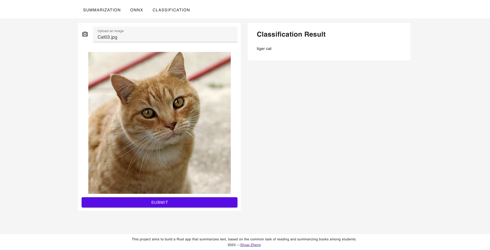

[](https://github.com/szheng3/rust_transfer_learning/actions/workflows/tests.yml)
[](https://github.com/szheng3/rust_transfer_learning/actions/workflows/release.yml)
[](https://github.com/szheng3/rust_transfer_learning/actions/workflows/lint.yml)
[](https://github.com/szheng3/rust_transfer_learning/actions/workflows/rustfmt.yml)
[](https://github.com/szheng3/rust_transfer_learning/actions/workflows/publish.yml)
[](https://github.com/szheng3/rust_transfer_learning/actions/workflows/bench.yml)

# Team Project: Rust Micro-Server for Image Classification
>Shuai Zheng, Yilun Wu, Yucheng Cao

This project aims to build a Rust micro-server that image classification.  The project is built with Rust, libtorch, and hugging-face pretrained models. The project is deployed on kubernetes.
It utilizes advanced AI transfer learning algorithms to classify uploaded images into four categories: normal, violence with a gun, porn, and labeled. The model is trained in Python, while the server is built in Rust.

## Project Goals/Outcomes


* Develop my Rust micro-service with kubernetes
* Use Github Codespaces and Copilot
* Integrate libtorch and 'hugging-face pretrained models' into a Rust web project

## Architectural Diagram


## Demo
* [https://apiv2.sszzz.me](https://apiv2.sszzz.me)
  


## Kubernetes Deployment
* go to the directory `K8s`
```
cd K8s
```

* create the namespace `resume-prod`
```
kubectl create namespace resume-prod

```
* apply the yaml files
```
kubectl apply -f .
```


## Docker(Recommended)

* This repo main branch is automatically published to Dockerhub with [CI/CD](https://github.com/szheng3/rust_transfer_learning/actions/workflows/publish.yml), you can pull the image from [here](https://hub.docker.com/repository/docker/szheng3/sz-rust-ml/general)
```
docker pull szheng3/sz-rust-ml:latest
```
* Run the docker image.
```
docker run -d -p 8000:8000 szheng3/sz-rust-ml:latest
```
* Run the docker image with GPU.
```
docker run -d -p 8000:8000 szheng3/sz-rust-ml:latest-gpu
```


## Setup Manually

1. Install rust via [rustup](https://rustup.rs/)
2. node
```
```


## Run app
* Build frontend
```
make web 
```
* Run, you can run the rust web app.
```
make run 
```

* Release
```
make releasex86
```

* Bench
```
make benchx86
```


## CI/CD

Github Actions configured in .github/workflows


## GitHub releases
The binary could be downloaded from the release pages. [release](https://github.com/szheng3/rust_transfer_learning/releases)

## Benchmark Results


## Load Test
|            CPU             |            GPU             |
|:--------------------------:|:--------------------------:|
|  |  |

## Logging


## Progress Log

- [x] Configure Github Codespaces.
- [x] Initialise Rust project with pretrained model from [hugging-face](https://huggingface.co/transformers/model_doc/bart.html)
- [x] CI/CD with Github Actions
- [x] Tag and Releases
- [x] Benchmark
- [x] kubernetes deployment
- [x] logging

## References


* [rust-cli-template](https://github.com/kbknapp/rust-cli-template)
* [rust-bert](https://github.com/guillaume-be/rust-bert)
* [tract](https://github.com/sonos/tract)